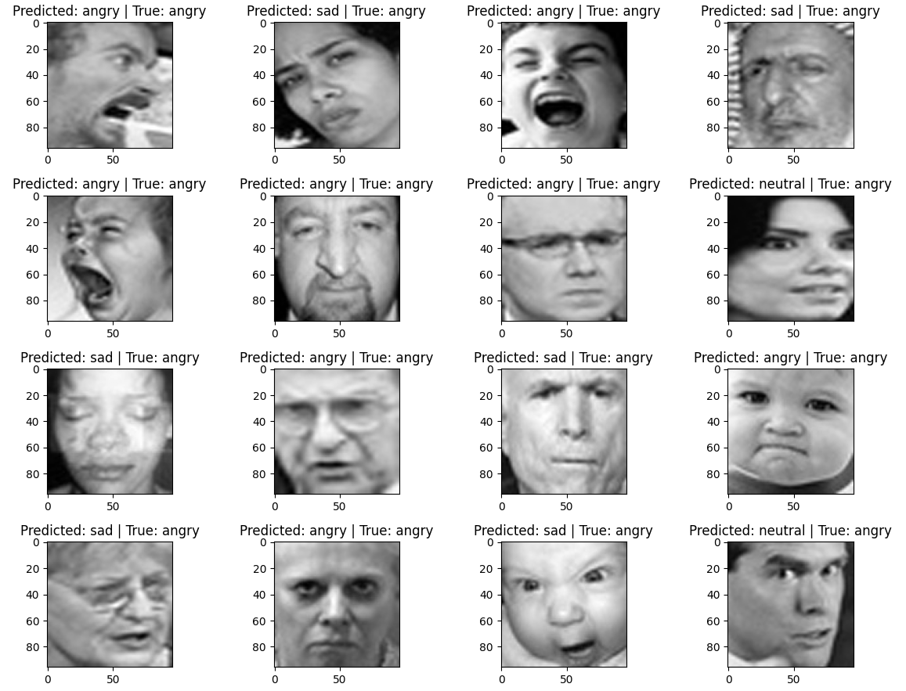

# Facial Expression Recognition 
**Model to classify facial expressions using PyTorch.**
 **Dataset**: https://www.kaggle.com/datasets/fahadullaha/facial-emotion-recognition-dataset (unfortunately, this is awful dataset. There are bunch of labels which are incorrect)
 **Stack**: Python Core, PyTorch, Torchvision, MLFlow
 **Results**: Developed custom CNN model. Applied optimizations like dropout, regularization, augmentation, etc. Achieved 70% accuracy. Model weights in `models`
  **Prediction example**:

